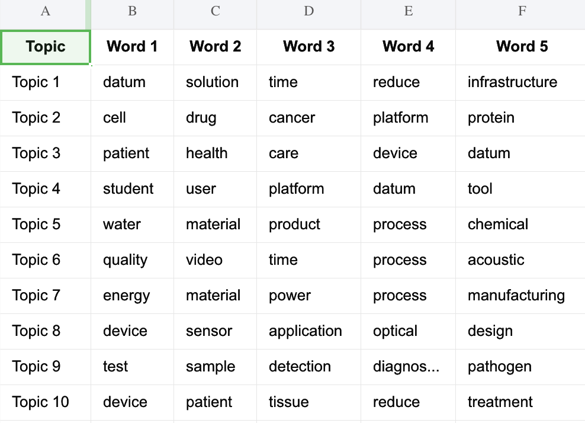
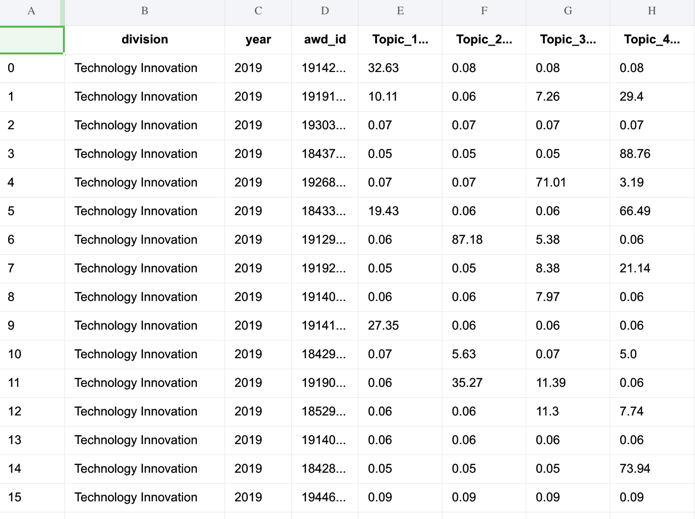
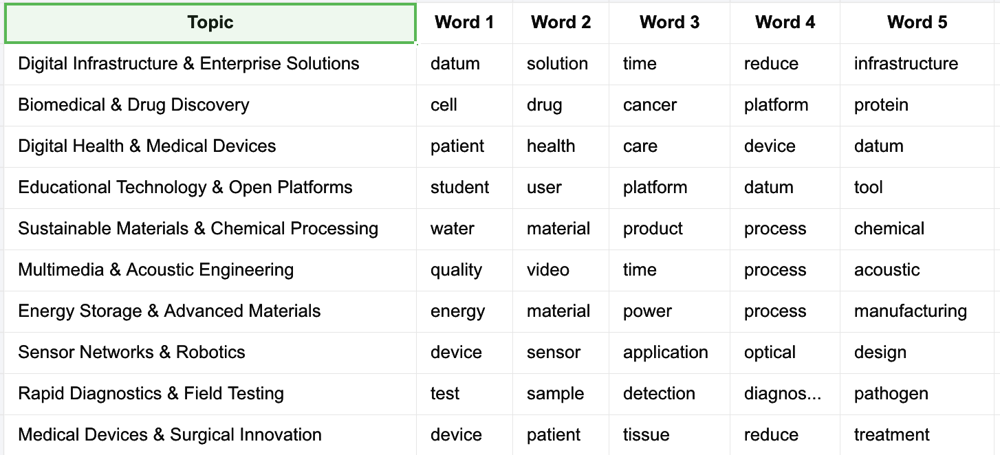
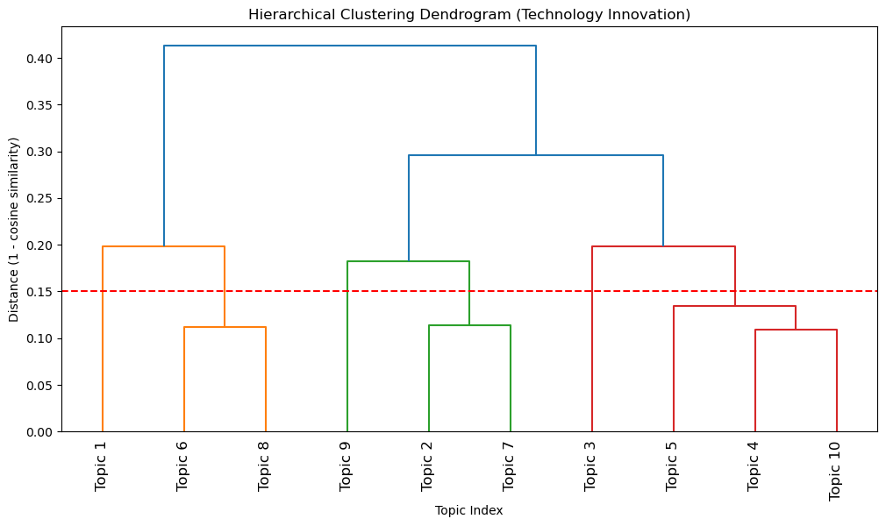

# NSF Grant Data Analysis: LDA Topic Modeling and Subtopic Clustering

This package implements a complete pipeline for analyzing NSF grant data using Latent Dirichlet Allocation (LDA) topic modeling and semantic subtopic clustering to identify research trends across divisions and over time.

```
lda_modeling/
├── __init__.py              # Package initialization
├── constants.py             # Division names and constants
├── data_loading.py          # Load grants data and terminated awards
├── data_cleaning.py         # Clean data and add columns
├── text_preprocessing.py    # Tokenization, bigrams, keyphrases
├── lda_modeling.py          # Train LDA models per division
├── export.py                # Export topics to Excel
├── subtopic_clustering.py   # Cluster similar topics using semantic embeddings
└── main.py                  # Main pipeline workflow
```

### Pipeline

The pipeline automatically:
1. Processes all grant data from 2019-2025
2. Trains division-specific LDA models
3. Exports topics and document assignments
4. Performs subtopic clustering
5. Generates yearly trend visualizations

## Output Files

- `lda_topics_by_division.xlsx`: Topics with top words per division
- `topic_assignments.csv`: Document-topic percentage assignments
- `clustered_subtopics_by_division.xlsx`: Clustered topics with combined keyphrases
- `clustered_subtopic_percentages/*.png`: Yearly trend plots for each division


## Methodology

### 1. Data Preparation

**Data Loading:**
- Requires downloading and saving 2019 - 2025 NSF grant JSON [files](https://www.nsf.gov/awardsearch/download-awards) to data folder
- Loads NSF data and appends them into a dataframe
- Combines abstract fields and removes NSF mission statements
- Maps division IDs to full names

**Text Preprocessing:**
- Tokenization with stopword removal 
- Bigram detection: 
  - Phrases must appear in ≥20 documents 
  - Phrases must co-occur with a threshold value of 100
    -  `cooccurence_score = (cooccurrence_count - min_count) × total_words / (word1_count × word2_count)`
- Trigram detection also included
- Lemmatization, reducing words to their base or dictionary form
- Vocabulary filtering: words appearing in <2 documents or >50% of documents removed

### 2. LDA Topic Modeling

**What is Latent Dirichlet Allocation (LDA)?**
- Latent Dirichlet Allocation (LDA) is an unsupervised probabilistic model that discovers hidden thematic structures in text
- Assumes each document is a mixture of topics, and each topic is a distribution over words
- Automatically identifies recurring patterns of co-occurring words across documents
- Outputs: (1) topic-word distributions (which words belong to each topic), (2) document-topic distributions (which topics appear in each document)

**Model Training:**
- Separate LDA model for each NSF division
- Minimum 50 grants required per division
- Minimum vocabulary size of 10 words required
- 10 topics created per division 
- 50 passes: Number of complete passes through the entire corpus
- 400 iterations: Maximum iterations per pass before moving to next pass (controls how thoroughly the model explores topic assignments within each pass)

**Output:**
- Topic-word distributions for each division:


- Document-topic assignments with percentage scores



### 3. Manually labeling Topics
- Manually labeled each of the groupings of words to provide a more meaningful name like "Astrophysics and Geology" instead of "Topic 1"




### 4. Subtopic Clustering

**Semantic Embedding:**
- Uses sentence transformers (`all-mpnet-base-v2`) to encode topic keyphrases
- Computes topic centroids by averaging keyphrase embeddings
- Normalizes embeddings for cosine similarity calculation

**Hierarchical Clustering:**
- Ward linkage with cosine distance
- Distance threshold: 0.15 (configurable)
- Groups semantically similar topics within each division
- Cluster names combine original topic names



**Reclassification:**
- Aggregates topic percentages by cluster
- Calculates yearly trends (2019-2025) for each cluster
- Generates visualizations showing cluster percentage changes over time

***International Science and Engineering:**
- Decrease in topics related to conservation biology and water


***Research on Innovative Technologies:**
- Decrease in atmospheric monitoring, increase in cloud computing


## [Back to Main README](../README.md)