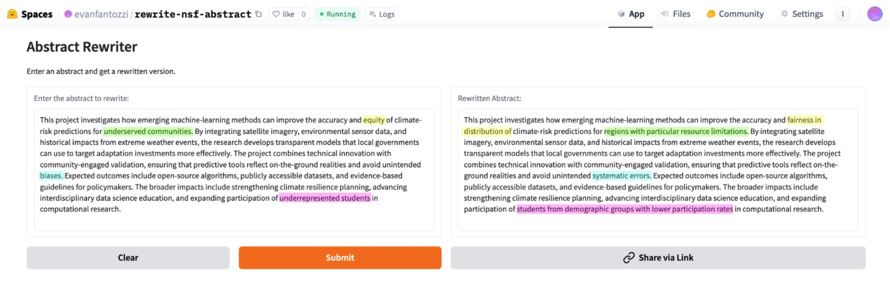

# NSF Abstract Rewriter

A Gradio web application that rewrites NSF grant abstracts by replacing banned words with neutral, scientific alternatives while preserving all factual content and maintaining the original structure and style.

Currently hosted at https://huggingface.co/spaces/evanfantozzi/rewrite-nsf-abstract 

## Setup

1. Install dependencies:
```bash
uv run pip install -r requirements.txt
```

2. Set environment variables:
```bash
export API_KEY="your-google-gemini-api-key" # Must replace with actual Google API key
export BANNED_WORDS=['banned', 'words'] # Must replace with actual list, located in models folder
```

3. Run the app:
```bash
uv run python app.py
```

## Usage

1. Enter an NSF-style abstract in the input textbox
2. Click submit to get the rewritten version
3. The app will:
   - Keep sentences without banned words exactly as written
   - Rewrite sentences with banned words using neutral alternatives
   - Maintain the same structure, tone, and style

Example: 



## [Back to Main README](../README.md)