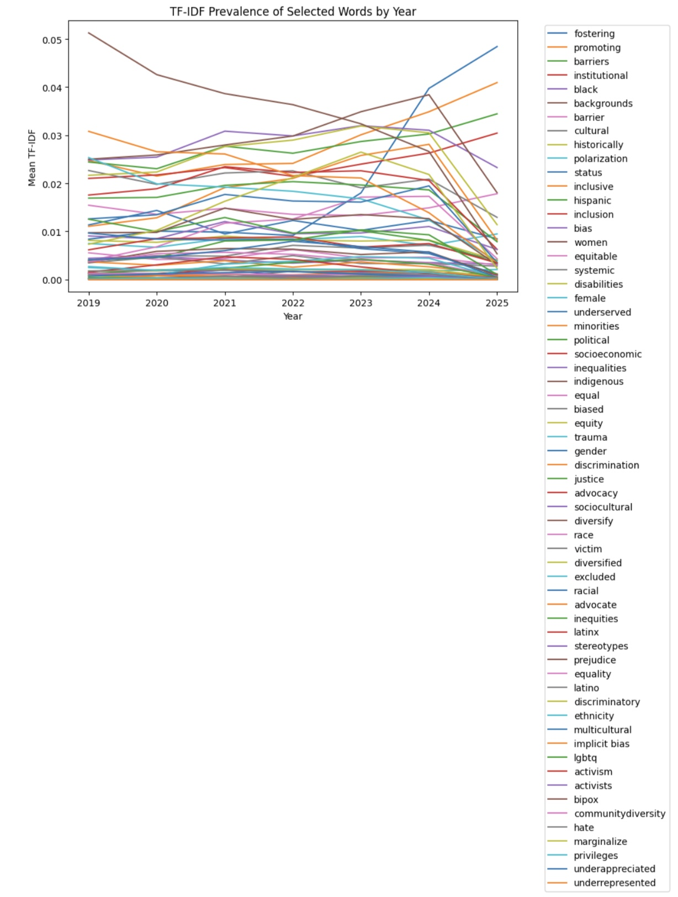
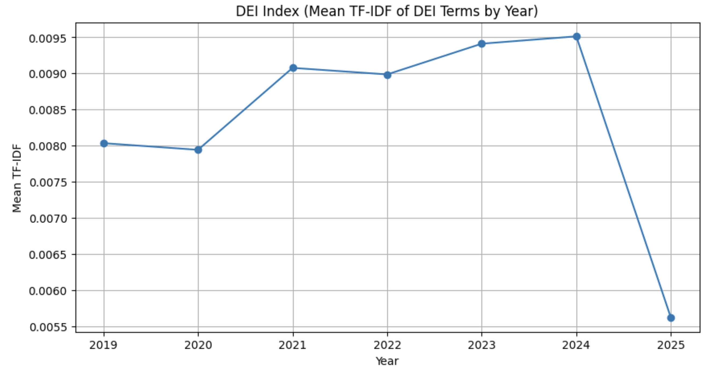
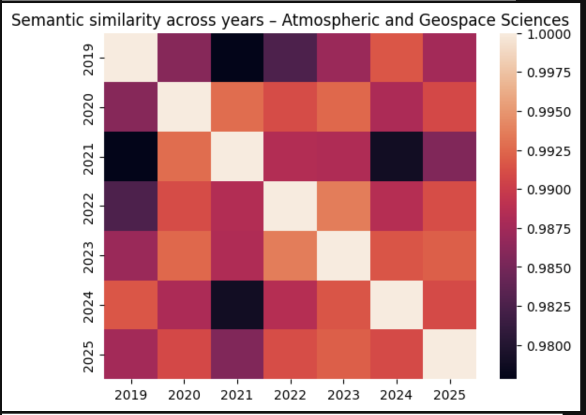
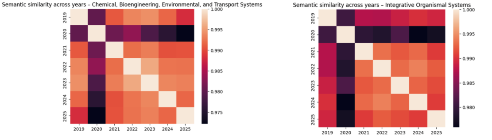
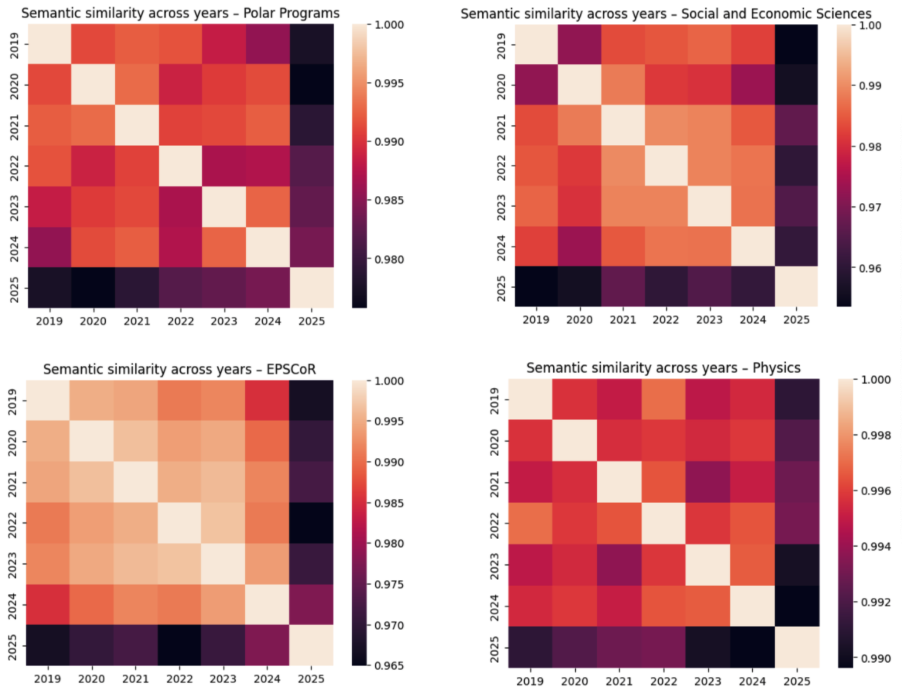

# TF-IDF, Semantic Similarity, and Bayesian Changepoint Analysis

This package analyzes NSF grant abstracts using TF-IDF analysis, semantic similarity metrics, and Bayesian changepoint detection to identify shifts in research language and topics over time.

## Package Structure

```
tfidf_semantic_changepoint/
├── __init__.py              # Package initialization
├── tfidf_analysis.py        # TF-IDF analysis of DEI keywords
├── semantic_similarity.py   # Semantic similarity using embeddings
├── changepoint_detection.py # Bayesian changepoint detection
└── main.py                  # Main pipeline workflow
```

## Features

### 1. TF-IDF Analysis
- Computes TF-IDF scores for DEI-related keywords across years
- Tracks prevalence of specific terms in grant abstracts
- Generates DEI index as aggregate measure
- Visualizes trends over time

### 2. Semantic Similarity Analysis
- Uses sentence transformers (`all-mpnet-base-v2`) to compute embeddings
- Calculates cosine similarity between year centroids
- Identifies semantic shifts within divisions
- Generates similarity heatmaps

### 3. Bayesian Changepoint Detection
- Detects structural breaks in semantic drift using PyMC
- Models changepoint year (τ) with uncertainty quantification
- Analyzes pooled and division-specific patterns
- Provides posterior distributions of changepoint locations

## Methodology

### TF-IDF Analysis
- **Keywords**: 60+ DEI-related terms (diversity, equity, inclusion, etc.)
- **N-grams**: 1-3 word phrases to capture multi-word expressions
- **Aggregation**: Mean TF-IDF per year across all grants
- **DEI Index**: Average TF-IDF across all keywords

### Semantic Embeddings
- **Model**: `sentence-transformers/all-mpnet-base-v2`
- **Centroids**: Mean embedding per year per division
- **Similarity**: Cosine similarity between year centroids
- **Drift**: Cosine distance from baseline (pre-2025 average)

### Bayesian Changepoint Model
- **Model Structure**:
  - Change-point year τ (discrete uniform prior)
  - Pre-change mean μ_pre (normal prior)
  - Post-change mean μ_post (normal prior)
  - Noise parameter σ (half-normal prior)
- **Inference**: MCMC sampling with PyMC (4 chains, 2000 draws)
- **Output**: Posterior distribution of changepoint year

## Usage

### Basic Pipeline

```python
from tfidf_semantic_changepoint.main import main

df, yearly_tfidf, drift_df, cp_trace = main(
    data_path="data/grants_df.json",
    output_dir="data/tfidf_semantic_analysis"
)
```

### Individual Components

**TF-IDF Analysis:**
```python
from tfidf_semantic_changepoint import tfidf_analysis

yearly_tfidf = tfidf_analysis.compute_tfidf_by_year(df)
yearly_tfidf["dei_index"] = tfidf_analysis.compute_dei_index(yearly_tfidf)
tfidf_analysis.plot_dei_index(yearly_tfidf)
```




**Semantic Similarity:**
```python
from tfidf_semantic_changepoint import semantic_similarity

drift_df = semantic_similarity.compute_semantic_drift(df)
semantic_similarity.plot_similarity_heatmap(df, "Physics")
```




**Changepoint Detection:**
```python
from tfidf_semantic_changepoint import changepoint_detection

cp_trace = changepoint_detection.fit_changepoint_model(drift_df)
changepoint_detection.plot_changepoint_posterior(cp_trace)
```

## Output Files

- `yearly_tfidf.csv`: TF-IDF scores by year and keyword
- `tfidf_trends.png`: Visualization of keyword trends
- `dei_index.png`: DEI index over time
- `similarity_*.png`: Semantic similarity heatmaps by division
- `semantic_drift.csv`: Yearly semantic drift values
- `changepoint_posterior.png`: Posterior distribution of changepoint year

## Requirements

- pandas
- numpy
- scikit-learn
- sentence-transformers
- pymc
- matplotlib
- seaborn
- scipy

## Notes

- Embeddings are computed once and stored in the DataFrame
- Analysis requires grants data with `tokenized_abstract` or `clean_text` column
- Changepoint detection uses Bayesian inference with MCMC sampling
- Results may vary slightly due to stochastic sampling

[Back to Main README](../README.md)
